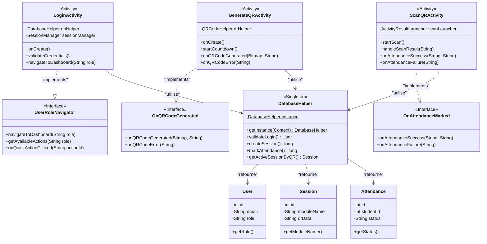

# Architecture Logicielle (MVC / Singleton)

L'application suit une structure proche du **Modèle-Vue-Contrôleur (MVC)** adaptée pour Android natif, couplée à l'utilisation du patron de conception **Singleton** pour la persistance locale.

## Structure de Packages

- `com.estsb.smartattendance.activities` : La logique de présentation (UI + interactions).
- `com.estsb.smartattendance.models` : Les classes objets (User, Session, Attendance).
- `com.estsb.smartattendance.database` : La couche d'accès aux données (SQLiteOpenHelper).
- `com.estsb.smartattendance.interfaces` : Les contrats de callback (exigence académique).
- `com.estsb.smartattendance.adapters` : Les adaptateurs RecyclerView (`AttendanceAdapter`).
- `com.estsb.smartattendance.utils` : Les helpers et gestion de session.
