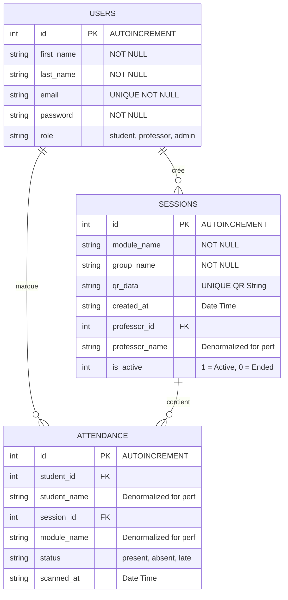

# Modèle Conceptuel de Données (MCD) / ERD

Ce diagramme illustre la structure de la base de données SQLite `smart_attendance.db` utilisée dans l'application. L'application utilise une architecture 100% locale pour ce modèle.

## Description des Entités

1. **USERS (Utilisateurs)** : Stocke tous les comptes utilisateurs (étudiants, professeurs, administrateurs). Authentification via `email` et `password`.
2. **SESSIONS (Séances d'absence)** : Représente une séance créée par un professeur. Le champ `qr_data` stocke la chaîne unique encodée dans le code QR que les étudiants vont scanner. `is_active` permet de bloquer les scans une fois la séance terminée.
3. **ATTENDANCE (Présences)** : Table associative qui relie un étudiant à une session. Interdit les doublons (un étudiant ne peut avoir qu'une seule présence par session active).
