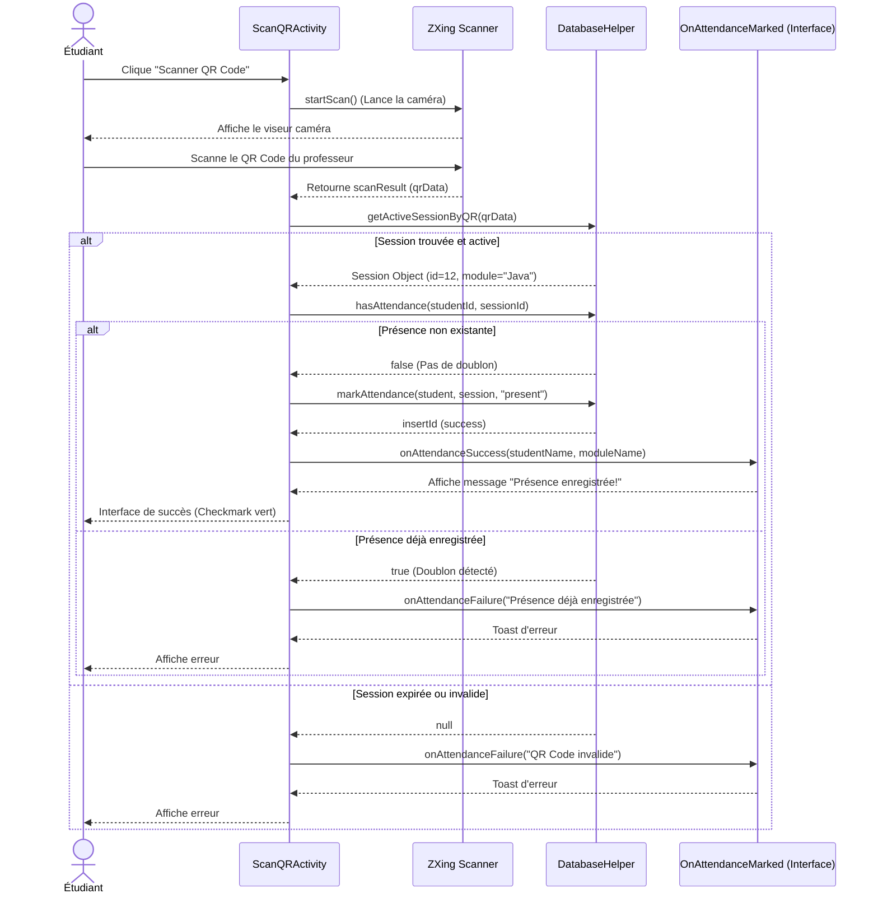

# Diagramme de Séquence : Flux de Scan QR

Ce diagramme de séquence illustre une des fonctionnalités clés de l'application : l'enregistrement de la présence par un étudiant via le scan d'un QR code. L'utilisation de l'interface obligatoire `OnAttendanceMarked` y est mise en évidence.

